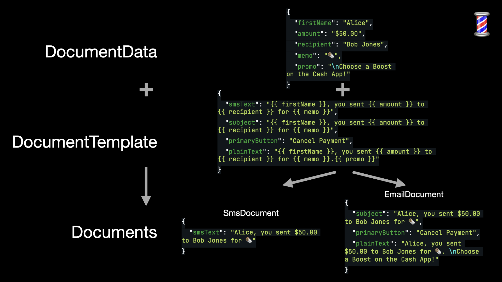

## Written for [Cash App Code Blog](https://cashapp.github.io/)

Cash App clients and services render thousands of English Mustache templates to send millions of personalized notifications, emails, text messages, and in-app UI daily to our customers.

In the past 2 years, as more engineers have joined Cash App and localization has risen to be top of mind, improving the developer experience and localization capabilities for our notification stack motivated us to build Barber.

Barber is a new Kotlin library for building up type-safe, localized, fillable documents using [Mustache](https://mustache.github.io/) templates.

Barber is now battle tested. Cash App has used Barber to render and send over 1 billion notifications. With no material performance cost, Barber provides extensive additional capabilities on top of basic Mustache templates.

Read more to find out why Barber is the best way to manage your Mustache.

## Type Safe

This is a Mustache template:

```
"{{ senderFirstName }}, you sent {{ amount }} to {{ recipient }} for {{ initiatorNote }}. \n{{ promoBlock }}!"
```

Mustache templates are untyped. This is flexible but not safe:

- What happens when a variable is missing or null?
- What happens when a variable is unused?
- What happens when a variable type is wrong?

With plain Mustache templates, silent failures are the default. Failures would go undetected until a customer reports that their notification from Cash App looks wrong.

Barber's type-safe Kotlin templates and validation catches errors at compile-time when engineers are writing code, not at runtime in front of customers.

## Fillable Documents

Documents are sometimes a single `{{ fillable }}` template string. Think of an SMS message template that only has a single body field.

```kotlin
val smsTemplate = "Alice, you sent $50.00 to Bob Jones for 🌯. \nChoose a Boost on the Cash App!"
```

But sometimes there are many templates that are always used together.
Consider below the many templates needed to render a personalized and themed email.

```kotlin
val subjectTemplate = "Alice, you sent $50.00 to Bob Jones for 🌯"
val bodyHtmlTemplate = "Alice, you sent $50.00 to Bob Jones for 🌯. \nChoose a Boost on the Cash App!"
val primaryButtonTemplate = "Cancel Payment"
val themeTemplate = "FLAT_GREEN"
val plainTextTemplate = "Alice, you sent $50.00 to Bob Jones for 🌯. \nChoose a Boost on the Cash App!"
```

Plain Mustache templates each need to be manually passed around, managed, rendered, and then stitched together into a final document.

Barber fillable Documents allow for a single data class to encapsulate, configure, and render all enclosed templates. Working with these in application code requires much less manual engineer coordination.

```kotlin
import app.cash.barber.models.Document

data class EmailDocument(
 val email_subject: String,
 val email_title: String,
 val email_subtitle: String,
 val email_code: String,
 @BarberField(encoding = STRING_PLAINTEXT)
 val email_plainText: String,
 val email_previewText: String,
 val email_buttonLabel: String,
 val email_buttonUrl: String,
) : Document
```

## Localized

Supporting multiple languages is hard. Adding the first language can be done by copy/pasting around the new translation. Scalable localization raises some questions:

- But how do we handle 2 or 3 or 10 languages?
- Could it be done in a way that minimizes boilerplate overhead to handle each additional translation?
- Could it have a pluggable fallback engine for when one language is requested but hasn’t yet been translated?

Plain Mustache templates do not have any localization primitives, so managing and retrieving translations falls on the engineer or using a separate localization library.

Barber lets you install templates for different languages and configure fallback logic for when a customer requests a language that is not yet translated.

```kotlin
val receiptBarber = barbershop.getBarber(RecipientReceipt::class)
val smsEN_US = receiptBarber.render(sandy50Receipt, EN_US)
// = Sandy Winchester sent you $50
val smsEN_CA = receiptBarber.render(sandy50Receipt, EN_CA)
// = Sandy Winchester sent you $50, eh?
val smsES_US = receiptBarber.render(sandy50Receipt, ES_US)
// = Sandy Winchester te envio $50
```

## Meet Barber

Barber makes rendering localized documents as easy as passing in the personalizing data and a locale, then renders a type-safe, multi-field, localized document.



```kotlin
val smsEN_US = receiptBarber.render(sandy50Receipt, EN_US)
// = SmsDocument(smsText = "Sandy Winchester sent you $50")
```

In June 2018, Barber launched on [Github](https://github.com/cashapp/barber) with [documentation](https://cashapp.github.io/barber/) and code examples.

Billions of notifications later, Barber remains the reliable render and template organization engine for Cash App.

Try it out for yourself and find out why Barber is the best way to manage your Mustache.
